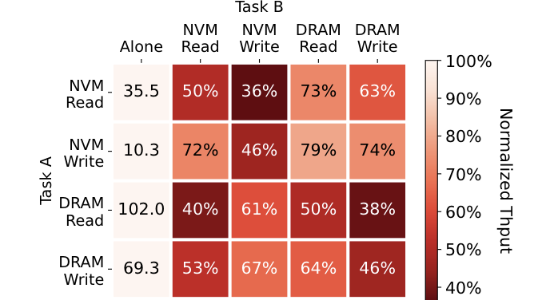
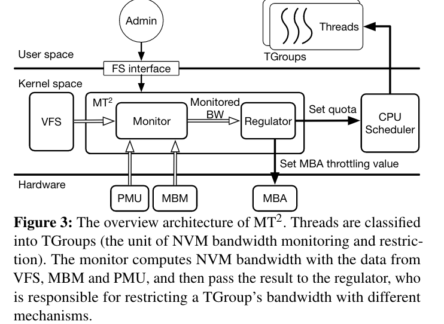

# [MT^2: Memory Bandwidth Regulation on Hybrid NVM/DRAM Platforms](https://www.usenix.org/system/files/fast22-yi_1.pdf)

## Introduction
近年来，非易失性内存正在被引入到数据中心中使用。例如：谷歌云就使用了2019年发布的傲腾内存，当前情况，NVM（Non-volatile memory）在数据中心中主要与DRAM并列使用，作为字节可寻址以及大容量的内存，这样数据中心就存在NVM/DRAM的混合内存结构。

在服务器中虚拟机、应用程序、容器共享着内存带宽，一个应用程序过多的使用了内存带宽，就会成为一个噪声邻居，影响干扰其他的程序，这就是邻居问题（noisy neighbor problem）。在多租户的云服务环境中，混合内存架构下，NVM和DRAM共同连接在总线上，使用不同内存的流量竞争带宽，加剧了邻居问题。

上图就是混合内存架构下，干扰问题的情况，被干扰的A任务，可使用的带宽就会下降，带宽的下降就会导致性能下降，如下图所示。

对混合内存的带宽进行管理是解决干扰问题的一种普遍方法。
### challenge
- 混合内存带宽的不对称问题
    - DRAM带宽 > NVM带宽
    - 内存带宽取决于内存访问，不再静态
- NVM和DRAM共享总线带宽，为每个进程去追踪内存的访问类型开销非常困难
- 调节带宽的硬件/软件支持机制不足，为每次访问去监视，开销太大了

## design

MT^2将线程分组管理，主要分为两个部分，一个是监视器（Monitor），一个是管理器（Regulator）。监视器利用现存的软硬件机制（可以参考原文背景知识部分）监测干扰情况以及各种内存的访问延迟。管理器得到监视器的信息，通过限制带宽的方式解决干扰问题。

## evaluation
这里给出fio测试的结果，原文还有其他负载的测试结果，与之前的图相比，干扰问题获得了缓解。

